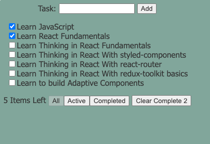
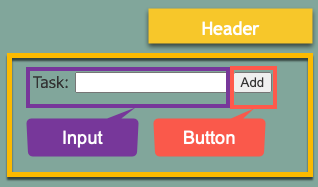
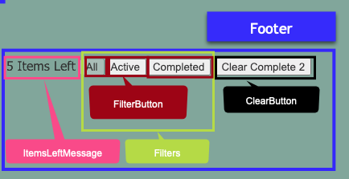
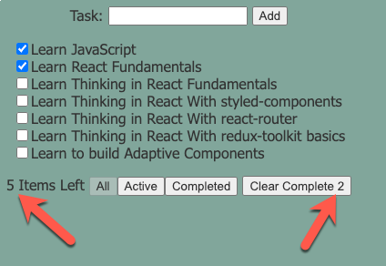

Thinking in React at scale contains three major concepts.

1. Composing components from smaller components.
2. Transforming the state you have into the state if you need.
3. Managing state

These concepts may seem obvious and over-simplistic but are too often ignored. I've reviewed over 1,000,000 lines of code in my 30-year career and too often see verbose, overly complicated code that is difficult to grok or change. Short, simple alternatives are preferred.

Here is the screen we are going to build:


---

### Step 1: Break down your screen into components

This page has 3 sections, header, body and footer.

Each section can be further broken into smaller components:




There is no one way to break apart the screen and I often change my mind when I learn more during implementation. The important thing is to avoid large monolithic components.

---

### Step two: Assemble static components with hard coded values.

Next we build the content of our components without worrying about interactivity or the source of data. In writing you this would be like building your outline.

It is not necessary to build all the rows. Here we cover both cases, checked and unchecked.

```
function Body() {
  return (
    <section className="inline">
      <ul>
        <Task name="Learn JavaScript" isCompleted={true} />
        <Task name="Learn React Fundamentals" isCompleted={true} />
        <Task name="Learn Thinking in React Fundamentals" isCompleted={false} />
      </ul>
    </section>
  );
}
```

Task uses the hard coded values supplied by props

```jsx
function Task(props) {
  const { name, isCompleted, onClick } = props;

  return (
    <li>
      <label>
        <input type="checkbox" checked={isCompleted} onChange={onClick} />
        {name}
      </label>
    </li>
  );
}
```

App follows 3 section layout discovered in step one.

```jsx
function App() {
  return (
    <div>
      <Header />
      <Body />
      <Footer />
    </div>
  );
}
```

The app so far on [code sandbox](https://codesandbox.io/p/github/afrievalt/thinking-samples/step2).

---

### Step 3: Identify the minimum state.

From the hard coded values discovered in the previous step, build the minimal state.

In our example, we have a list of tasks:

```js
const initialState = [
    { id: 1, name: "Learn JavaScript", isCompleted: true },
    { id: 2, name: "Learn React Fundamentals", isCompleted: true },
    …
```

Our second and final pice of state is a string filter that can be one of "All", "Completed" or "Active"

Notice some dynamic values appear on the screen that are not in the minimum state. These values are derived from our minimum state. Misidentifying derived values is a common mistake to watch out for.  


---

### Step 4: Transform the state you have into the values you need.

First we will apply our filters to our task list.

```js
// App.js
const isCompletedFilter = filter === "Completed";
// filter out tasks that are not displayed
const displayTasks = tasks.filter(({ isCompleted }) => {
  // if "All" show all
  if (filter === "All") {
    return true;
  }
  // if "Completed" show only completed, if "Active" show only completed === false
  return isCompleted === isCompletedFilter;
});
```

Next we will calculate the Active Count

```js
// ItemsLeftMessage.js
const activeTasks = tasks.filter(({ isCompleted }) => {
  return isCompleted === false;
});
const activeCount = activeTasks.length;
```

We also disable the selected filter

```js
// FilterButton.jsx
// value prop is the button value ("All") and filter prop is the current user selected filter.
const isDisabled = value === filter;
```

Then we calculate the Completed count. And finally hide the clear button when there are no completed items.

```jsx
function ClearButton(props) {
  const { tasks } = props;
  const completeCount = tasks.filter(({ isCompleted }) => isCompleted).length;
  if (completeCount === 0) {
    return null;
  }
  return <button>Clear Complete {completeCount}</button>;
}
```

The app so far on [code sandbox](https://codesandbox.io/p/github/afrievalt/thinking-samples/step4).

At this point, the user is unable to make changes, but you can modify state to see how it effects the screen. In App.js, change the filter from "All" to "Active". Change a task from isCompleted: false to true.

---

### Step five: Update state.

Identify how user interactions effect state, not the screen. This is one of the most important concepts to master when thinking in react.

For now, lets hold state in App.js with useState.

```jsx
function NoLibApp() {
  const [tasks, setTasks] = useState(initState);
  const [filter, setFilter] = useState("All");
  const isCompletedFilter = filter === "Completed";
  const displayTasks = tasks.filter(({ isCompleted }) => {
    if (filter === "All") {
      return true;
    }
    return isCompleted === isCompletedFilter;
  });
  return (
    <div>
      <Header setTasks={setTasks} />
      <Body tasks={displayTasks} setTasks={setTasks} />
      <Footer
        filter={filter}
        setFilter={setFilter}
        tasks={tasks}
        setTasks={setTasks}
      />
    </div>
  );
}
```

First lets handle adding a new task.

```js
function Header(props) {
  const ref = useRef();
  const { setTasks } = props;
  const handleSubmit = (e) => {
    // get task name with white space removed form beginning and end.
    const name = ref.current.value?.trim();
    // get a unique id (we will improve this later)
    const id = Math.random();
    // build the new task
    const task = {
      id,
      name,
      isCompleted: false,
    };
    // if name is empty, don't add
    if (name) {
      // append task.  (Don't use closure values in set*)
      setTasks((oldValues) => [...oldValues, task]);
      ref.current.value = "";
    }
    e.preventDefault();
  };

  return (
    <form className="inline" onSubmit={handleSubmit}>
      <Input ref={ref} label="Task" />
      <input type="submit" value="Add" />
    </form>
  );
}
```

Second lets handle marking a completing as complete.

```jsx
function Body(props) {
  /* 
    Danger: Do not copy.
    I'm intentionally introducing some anti-patterns to improve later.
    Can you find them?
  */
  const { tasks, setTasks } = props;
  const acquireHandleClick =
    (task) =>
    // return a callback to handle click
    (e) => {
      const { id } = task;
      const newTasks = [...tasks]; // make a shallow copy
      const i = newTasks.findIndex((task) => task.id === id); // find tasks to update
      newTasks[i].isCompleted = e.target.checked; // update new task
      setTasks(newTasks); // set new tasks
    };
  return (
    <section className="inline">
      <ul>
        {tasks.map((task) => {
          return (
            <Task
              key={task.id}
              name={task.name}
              isCompleted={task.isCompleted}
              onClick={acquireHandleClick(task)}
            />
          );
        })}
      </ul>
    </section>
  );
}
```

